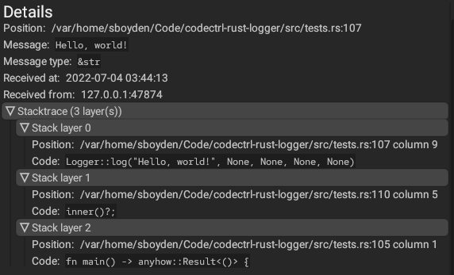

# CodeCTRL Rust Logger

The Rust-based logger for integration with
[CodeCTRL](https://github.com/Authentura/codectrl).

## What is the purpose of this?

The purpose of this logger and CodeCTRL in general is to be able to better
understand the control-flow, data and to find potential UB in Rust-based
projects.

We at [Authentura](https://authentura.com) have and will use CodeCTRL and its
language loggers to help us perform our code analysis service: Rust included.

## How does it work?

This logger (and the rest of the official-loggers) connect to a
CodeCTRL-compatible gRPC server and send a user-created log at a specified
point in the code. A CodeCTRL front-end can then connect to those very same
gRPC servers and receive a copy of the sent logs to that server.

This Rust implementation connects to the gRPC server using a crate called
[`tonic`](https://crates.io/tonic), which is a handy crate to generate common
interfaces to a gRPC server and connect to said gRPC servers.

## Example

Here's a quick example of how to use this crate:

```rust
use codectrl_logger::{Logger, LoggerError};
use tokio::runtime::Handle;

fn main() -> anyhow::Result<()> {
  fn inner() -> Result<(), LoggerError> {
    Logger::log("Hello, world!", None, None, None, None)
  }

  inner()?;

  Ok(())
}
```

Which will produce the following output in the details panel of CodeCTRL:


